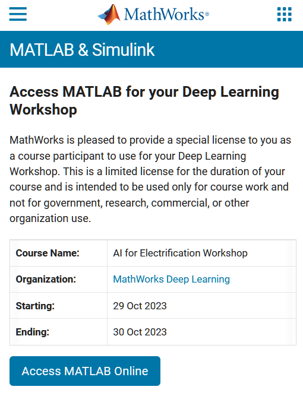
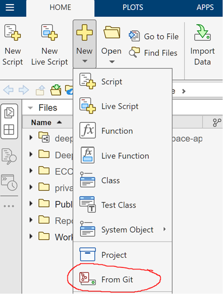
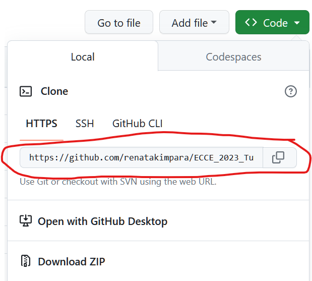

# Artificial Neural Networks for Power Electronics - A Hands-On Approach
## Instructions for Tutorial at ECCE 2023

### **Step 1:** Access MATLAB Online

Click on the following link to access MATLAB Online. You will need to log in using your MathWorks account. If you do not already have an account, you can create a new one for free.

**Link:** [https://www.mathworks.com/licensecenter/classroom/4221450/](https://www.mathworks.com/licensecenter/classroom/4221450/)

### **Step 2:** Clone tutorial files into MATLAB Online

After accessing MATLAB Online and opening the MATLAB Online editor, clone the tutorial project using the From Git option as in the image below.

Use the cloning link from this Git repo as the URL when prompted for an address.

